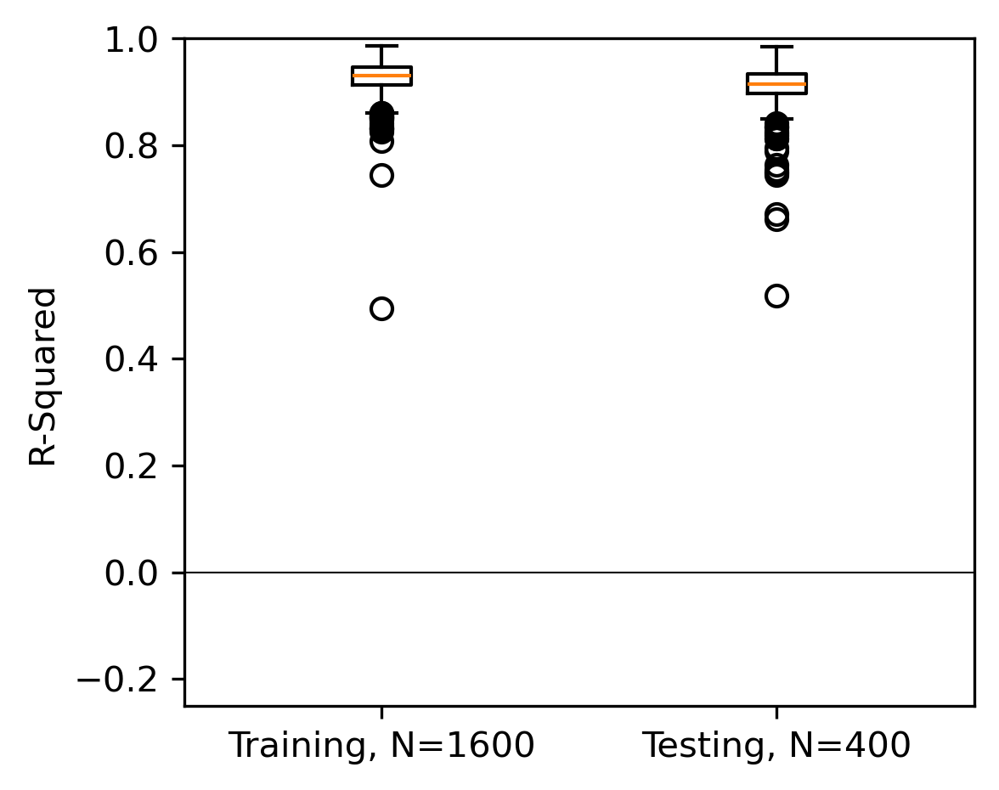
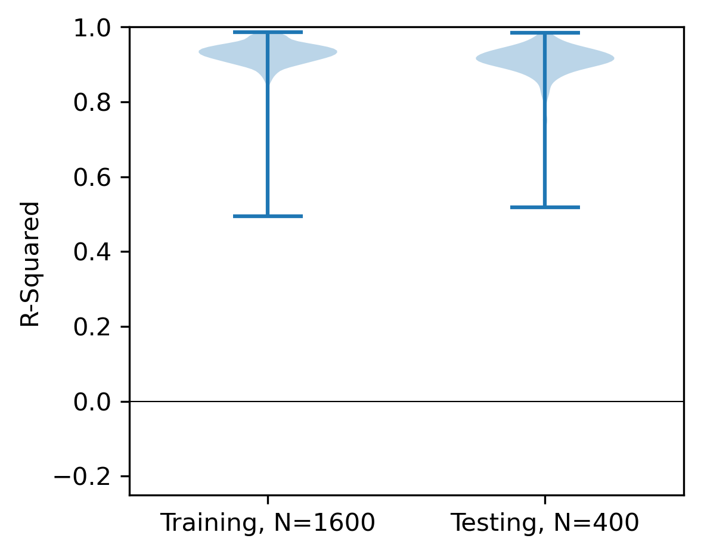

# Scalar Field Prediction on Meshes Using Interpolated Multiresolution Convolutional Neural Networks


## Trained Model Results

This repository includes a trained model (`multi_model_6.pth`) with GPU support for fast inference on 2D mesh stress field prediction.

### Performance Metrics

| Dataset | Median R² | Mean R² | Min R² | Max R² |
|---------|-----------|---------|--------|--------|
| **Training** | 0.925 | 0.908 | 0.131 | 0.995 |
| **Testing** | 0.911 | 0.893 | 0.093 | 0.985 |

**Training Details:**
- Dataset: 1600 combined Voronoi + Lattice geometries
- Architecture: 6 pooling layers, 20 filters
- Model parameters: 34,981

### Visualization Results

#### Stress Field Predictions

*Ground truth vs predicted stress fields on test samples (best, median, worst R²)*

#### Performance Distribution
<table>
<tr>
<td></td>
<td></td>
</tr>
</table>

*R² distribution across training and testing datasets*

---

## Quick Start (GPU-Accelerated)

### 1. Setup Environment

For **GPU training** (CUDA 12.1+):
```bash
conda create -y -n multires_env python=3.10 numpy scipy matplotlib -c conda-forge
conda activate multires_env
conda install -y pytorch torchvision torchaudio pytorch-cuda=12.1 -c pytorch -c nvidia
conda install -y -c conda-forge gdown
```

For **CPU-only**:
```bash
conda create -y -n multires_env numpy scipy matplotlib pytorch torchvision torchaudio cpuonly -c pytorch
conda activate multires_env
conda install -y -c conda-forge gdown
```

### 2. Download Data

```bash
python scripts/download_datasets.py
```
Downloads 9 datasets (Voronoi + Lattice shapes, stress + temperature fields)

### 3. Train Model

**Quick training** (single combined model):
```bash
python scripts/train_single_model.py
```
- Trains on 1600 samples
- Saves to `models/multi_model_6.pth`

**Full training** (all 11 models from paper):
```bash
python scripts/train_models.py
```

### 4. Evaluate & Visualize

```bash
# Evaluate performance
python scripts/evaluate_trained_model.py

# Generate performance tables
python scripts/print_tables_simple.py

# Generate visualization figures
python scripts/generate_figures_simple.py
```

Results saved to `figures/` folder.

---

## Original Paper Information

#### Authors
_Kevin Ferguson_, Carnegie Mellon University
James Hardin, Air Force Research Lab
Andrew Gillman, Air Force Research Lab
Levent Burak Kara, Carnegie Mellon University

### Abstract

[Paper Link](https://asmedigitalcollection.asme.org/appliedmechanics/article/91/10/101002/1201208)

Scalar fields, such as stress or temperature fields, are often calculated in shape optimization and design problems in engineering. For complex problems where shapes have varying topology and cannot be parametrized, data-driven scalar field prediction can be faster than traditional finite element methods. However, current data-driven techniques to predict scalar fields are limited to a fixed grid domain, instead of arbitrary mesh structures. In this work, we propose a method to predict scalar fields on arbitrary meshes. It uses a convolutional neural network whose feature maps at multiple resolutions are interpolated to node positions before being fed into a multilayer perceptron to predict solutions to partial differential equations at mesh nodes. The model is trained on finite element von Mises stress fields, and once trained, it can estimate stress values at each node on any input mesh. Two shape datasets are investigated, and the model has strong performance on both, with a median R2 value of 0.91. We also demonstrate the model on a temperature field in a heat conduction problem, where its predictions have a median R2 value of 0.99. Our method provides a potential flexible alternative to finite element analysis in engineering design contexts.

## Citation

Consider citing the following:

- Ferguson, K., Gillman, A., Hardin, J., and Kara, L. B. (July 12, 2024). "Scalar Field Prediction on Meshes Using Interpolated Multiresolution Convolutional Neural Networks." ASME. J. Appl. Mech. October 2024; 91(10): 101002. https://doi.org/10.1115/1.4065782

BibTex:
```
@article{ferguson-2024-multiresolution,
    author = {Ferguson, Kevin and Gillman, Andrew and Hardin, James and Kara, Levent Burak},
    title = {Scalar Field Prediction on Meshes Using Interpolated Multiresolution Convolutional Neural Networks},
    journal = {Journal of Applied Mechanics}, volume = {91}, number = {10}, pages = {101002},
    year = {2024}, month = {07},
    issn = {0021-8936},
    doi = {10.1115/1.4065782},
    url = {https://doi.org/10.1115/1.4065782},
    eprint = {https://asmedigitalcollection.asme.org/appliedmechanics/article-pdf/91/10/101002/7353098/jam\_91\_10\_101002.pdf},
}
```

---

## Repository Structure

```
sfp-cnn/
├── data/                    # Downloaded .mat datasets
├── models/                  # Trained model files
│   └── multi_model_6.pth   # Main trained model
├── figures/                 # Generated plots and tables
│   ├── stress_predictions.png
│   ├── r2_boxplot.png
│   ├── r2_violin.png
│   └── r2_table_multi_model_6.txt
├── scripts/                 # Training and evaluation scripts
│   ├── download_datasets.py
│   ├── train_single_model.py          # Quick training (recommended)
│   ├── train_models.py                # Full paper replication
│   ├── evaluate_trained_model.py      # Performance evaluation
│   ├── print_tables_simple.py         # Generate tables
│   └── generate_figures_simple.py     # Generate plots
├── utils/                   # Core library functions
│   ├── cnn_model.py        # Multi-resolution CNN architecture
│   ├── unet_model.py       # U-Net baseline
│   ├── training.py         # Training loop (GPU-accelerated)
│   ├── evaluate.py         # R² evaluation
│   ├── load_data.py        # Data loading
│   └── visualize.py        # Plotting functions
└── inspect_mat_file.py     # Data format inspection tool
```

## Key Features

✅ **GPU Acceleration**: Automatic CUDA device detection
✅ **Pre-trained Model**: Ready-to-use `multi_model_6.pth`
✅ **2D Mesh Support**: Arbitrary triangular meshes
✅ **Stress Prediction**: Von Mises stress field estimation
✅ **Visualization Tools**: Built-in plotting for results

## Custom Data Format

See [inspect_mat_file.py](inspect_mat_file.py) for details on .mat file format.

**Required fields:**
- `nodes`: (2, num_nodes) - X, Y coordinates
- `elem`: (3, num_elements) - Triangle connectivity
- `stress`: (num_nodes, 1) - Scalar field values
- `dt`: (num_nodes, 1) - Distance transform
- `sdf`: (64, 64) - Signed distance field

## Notes

- **2D Only**: This model works with 2D planar meshes (X, Y coordinates)
- **For 3D**: See related work or contact authors
- **OOD Detection**: Out-of-distribution detection available in `ood/` folder (optional)

### Acknowledgment
This research was funded by Air Force Research Laboratory contract FA8650-21-F-5803.
